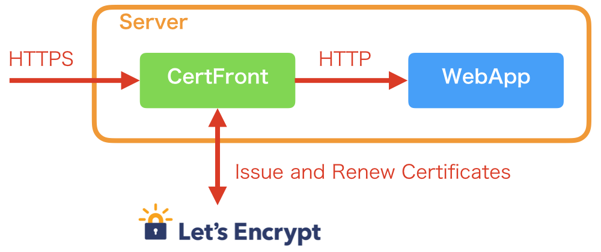

# CertFront
Publish your web application with full managed SSL certificate.



## Features
- Automatically issue and renew SSL certificate, powered by Certbot.
- Accept HTTP (port 80) request and redirect to HTTPS.
- Accept HTTPS (port 443) request and proxy to your web application.

## Example
Here is an example of running WordPress with custom domain and https.

``` yaml:docker-compose.yml
version: '3'

services:

  certfront:
    image: leachjp/certfront
    ports:
      - 80:80
      - 443:443
    environment:
      DOMAIN: blog.example.com  # modify this to your domain
      EMAIL: mail@example.com  # modify this to your email
      CLIENT_MAX_BODY_SIZE: 200m # nginx's client_max_body_size param. 
      APP_HOST: wordpress
    volumes:
      - certs:/etc/letsencrypt
    depends_on:
      - wordpress

  wordpress:
    image: wordpress:4
    environment:
      WORDPRESS_DB_HOST: mysql
    volumes:
      - app:/var/www/html
    depends_on:
      - mysql

  mysql:
    image: mysql:5
    environment:
      MYSQL_ALLOW_EMPTY_PASSWORD: 'yes'
    volumes:
      - data:/var/lib/mysql

volumes:

  # The certificate and private key are stored on this volume
  certs:
    driver: local

  app:
    driver: local

  data:
    driver: local
```

Save this to `docker-compose.yml` and run `docker-compose up`, then try to access `https://blog.example.com`.
